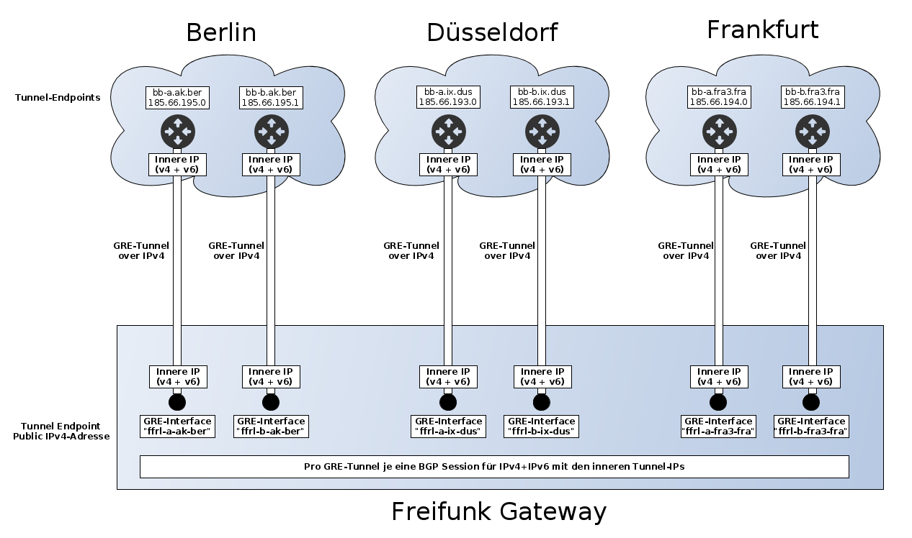

.. _internetexit:

Internet-Exit
=============

Um den Internet-Verkehr abzuwickeln existieren mehrere Möglichkeiten. Wir gehen hier auf die folgenden zwei Varianten ein.

    - :ref:`vpnprovider`
    - :ref:`freifunk-rheinland`

Achtung, die Konfiguration dieser Varianten unterscheiden sich sehr stark.

.. _vpnprovider:

VPN Provider
------------

Prinzipiell kann jeder beliebige Internet-Provider gewählt werden. Die Konfiguration hier beschreiben wir am Beispiel von `Perfect Privacy`_.

Als erstes entledigt man sich aller alter Konfiguration::

    rm -rf /etc/openvpn/*

Eine angepasste und lauffähige Konfiguration bekommt man meist vom Anbieter, in diesem Fall auch von Perfect Privacy, die es herunterladen und zu entpacken gilt.

Konvention für die Konfigurationsdateien::

    /etc/openvpn/perfect_privacy      -> Ordner mit allen Konfigurationsdateien, Zertifikaten, etc. des Providers
    /etc/openvpn/perfect_privacy.conf -> Symlink auf die entsprechende Konfigurationsdatei im Unterordner "perfect_privacy"

Wir wählen z.B. den Exit-Server in Frankfurt, setzen den Symlink::

    cd /etc/openvpn
    ln -s perfect_privacy/Frankfurt.ovpn perfect_privacy.conf

Nun muss die Konfiguration aufgrund der Pfade, des Routings des unten aufgeführten Hook-Scripts angepasst werden::

    dev-type tun
    dev exitVPN
    auth-user-pass perfect_privacy/auth/auth.txt
    #redirect-gateway def1
    #route-delay 2
    #route-method exe
    route-noexec
    ...
    ca perfect_privacy/ca.crt
    cert perfect_privacy/Frankfurt_cl.crt
    key perfect_privacy/Frankfurt_cl.key
    tls-auth perfect_privacy/Frankfurt_ta.key 1
    down /etc/openvpn/openvpn-updown
    up /etc/openvpn/openvpn-updown

Wir haben nun alles Routing-spezifische in OpenVPN deaktiviert und nutzen dafür unser eigenes Hook-Script. /etc/openvpn/openvpn-updown::

    #!/bin/sh

    # http://manpages.ubuntu.com/manpages/maverick/en/man8/openvpn.8.html#contenttoc5

    set -x

    ENVFILE="/tmp/ovpn-env-up"
    echo "$@"  > "$ENVFILE"
    env >> "$ENVFILE"

    manage_vpn_peer_routes() {
            ACTION="$1"
            ip route $ACTION "$route_vpn_gateway" dev "$dev" src "$ifconfig_local" table ffinetexit
    }

    manage_vpn_default_routes() {
            ACTION="$1"
            ip route $ACTION 0.0.0.0/1 via "$route_vpn_gateway" src "$ifconfig_local" table ffinetexit
            ip route $ACTION 128.0.0.0/1 via "$route_vpn_gateway" src "$ifconfig_local" table ffinetexit
    }

    if [ "$script_type" = "up" ]; then
            manage_vpn_peer_routes add
            manage_vpn_default_routes replace
    elif [ "$script_type" = "down" ]; then
            manage_vpn_peer_routes del
    fi

    exit 0

Policy Routing
^^^^^^^^^^^^^^

Wir fügen nun noch die nötigen IP Rules in die /etc/rc.local ein::

    ...
    # Priority 7 - lookup rt_table mwu for all incoming traffic of freifunk related interfaces
    ...
    ip -4 rule add from all iif exitVPN lookup mwu priority 7
    ...
    ip -6 rule add from all iif exitVPN lookup mwu priority 7

    ...

    # Priority 61 - at this point this is the end of policy routing for freifunk related routes
    ...
    ip -4 rule add from all iif exitVPN type unreachable priority 61
    ...
    ip -6 rule add from all iif exitVPN type unreachable priority 61
    ...

.. seealso::
    - :ref:`routing_tables`
    - :ref:`policyrouting`

Firewall
^^^^^^^^
Um das Netz des ExitVPN Anbieters via NAT mit unserem zu verbinden muss Masquerading aktiviert werden::

  iptables -t nat -A POSTROUTING -s 10.37.0.0/18,10.56.0.0/18 -o exitVPN -j MASQUERADE

und speichert dann die iptables config einmalig::

  iptables-save > /etc/iptables/rules.v4

.. _Perfect Privacy: https://www.perfect-privacy.com

.. _freifunk-rheinland:

Freifunk Rheinland e.V.
-----------------------

Der Freifunk Rheinland e.V. war es Leid auf VPN-Provider angewiesen zu sein und hat die Anbindung an das Internet selbst in die Hand genommen. Dazu sind sie RIPE-Mitglied sowie Sub-LIR geworden und haben unter Anderen das IPv6-Prefix 2a03:2260::/29 sowie noch ein IPv4-Netz ergattert: 185.66.192.0/22. 

Im Laufe des Jahres 2015 hat Freifunk Rheinland eine beachtliche Infrastruktur aufgebaut. Sie peeren z.B. in Berlin, Düsseldorf und Frankfurt an sogenannten Internet Exchange Points (IXP), um deren zugewiesenen IP-Netze ins Internet zu "announcen".

Die RIPE-Mitgliedschaft, das Peering in den IXPs sowie die erforderliche Hardware dafür ist alles andere als günstig. Nicht jede Freifunk Community kann sich das leisten bzw. hat überhaupt die Manpower und Know-How derartiges zu realisieren. Deshalb bietet der Freifunk Rheinland anderen Freifunk Communities die Internet-Abwicklung über deren Infrastrukur an.

Wichtige Informationen über den Freifunk Rheinland e.V.:

 - `Freifunk Rheinland Homepage`_

 - `Rheinland Backbone Documents and Policies`_

 - `Backbone-announce`_ Mailing-Liste

 - Kategorie `Rheinland Backbone im Freifunk Forum`_

 - `Ticket-System`_

 - Autonomous System Number `AS201701`_

   - BGP Infos über dieses AS gibts bei `bgp.he.net`_

 - Videos über das Rheinland Backbone

   - `Wie funktioniert der Rheinland Backbone?`_
   - `Wie funktioniert AS201701?`_

Freifunk MWU IP-Netze
^^^^^^^^^^^^^^^^^^^^^

Wir haben vom Freifunk Rheinland folgende IP-Netze erhalten:

 - Mainz

   - `2a03:2260:11a::/48`_
   - `185.66.195.32/30`_

 - Wiesbaden

   - `2a03:2260:11b::/48`_
   - `185.66.195.36/30`_

Technischer Aufbau
^^^^^^^^^^^^^^^^^^

Übersicht über die GRE-Endpunkte von Freifunk Rheinland:

 - Berlin

   - bb-a.ak.ber / 185.66.195.0
   - bb-b.ak.ber / 185.66.195.1

 - Düsseldorf

   - bb-a.ix.dus / 185.66.193.0
   - bb-b.ix.dus / 185.66.193.1

 - Frankfurt

   - bb-a.fra3.fra / 185.66.194.0
   - bb-b.fra3.fra / 185.66.194.1

Prinzipiell wird von jedem Freifunk-Gateway zu jedem dieser Endpunkte ein GRE-Tunnel über IPv4 aufgebaut. Die oben aufgelisteten Endpunkte sowie die öffentliche IPv4-Adresse des Freifunk-Gateways stellen die äußeren Tunnel-IPs dar. Jeder GRE-Tunnel hat je ein Transfernetz für IPv4 und IPv6 für die innere Kommunikation:

 - IPv4: /31

   - niederwertige IP = Rheinland
   - höherwertige IP = Freifunk-Gateway

 - IPv6: /64

   - <Prefix>::1 = Rheinland
   - <Prefix>::<beliebig> = Freifunk-Gateway

Dieser schematische Aufbau soll das Konstrukt etwas verdeutlichen:

Pro GRE-Tunnel wird dann je eine BGP-Session für IPv4 und IPv6 aufgebaut, über die wir die uns zugewiesene IPv4-NAT-Adresse bzw. unsere IPv6-Prefixe announcen.

Konfiguration
^^^^^^^^^^^^^

Zunächst nochmal die Übersicht über alle benötigten IP-Adressen:

 - öffentliche IPv6-Prefixe

   - Mainz: 2a03:2260:11a::/48
   - Wiesbaden: 2a03:2260:11b::/48
   - aktuell wird immer das erste /64er Subnetz verwendet
   - Die IPv6-Adressen der Gates ergeben sich aus dem Prefix und dem bisherigen Interface-Identifier

 - öffentliche IPv4-Netze

   - Mainz: 185.66.195.32/30
   - Wiesbaden: 185.66.195.36/30
   - diese stellen "NAT-IP-Adressen" dar, jedes Gateway erhält eine öffentliche NAT-IP-Adresse

 - dazu kommen noch die inneren Transfernetze, die sich pro Gate unterscheiden

In der folgenden Tabelle halten wir die inneren Transfernetze und IPv4-NAT-Adressen der Gateways fest:

================ ================ ========================= ========================= ========================= ========================= =========================== ===========================
Gateway          IPv4-NAT-Adresse Transfernetze bb-a.ak.ber Transfernetze bb-b.ak.ber Transfernetze bb-a.ix.dus Transfernetze bb-b.ix.dus Transfernetze bb-a.fra3.fra Transfernetze bb-b.fra3.fra
================ ================ ========================= ========================= ========================= ========================= =========================== ===========================
Kaschu           185.66.195.37    100.64.2.100/31 -         100.64.2.102/31 -         100.64.2.104/31 -         100.64.2.106/31 -         100.64.2.108/31 -           100.64.2.110/31 -
                                  2a03:2260:0:13b::/64      2a03:2260:0:13c::/64      2a03:2260:0:13d::/64      2a03:2260:0:13e::/64      2a03:2260:0:13f::/64        2a03:2260:0:140::/64
Lotuswurzel      185.66.195.36    100.64.1.190/31 -         100.64.1.20/31 -          100.64.2.84/31 -          100.64.1.22/31 -          100.64.1.192/31 -           100.64.2.86/31 -
                                  2a03:2260:0:e9::/64       2a03:2260:0:91::/64       2a03:2260:0:133::/64      2a03:2260:0:92::/64       2a03:2260:0:ea::/64         2a03:2260:0:134::/64
Zitronengras     185.66.195.39    100.64.2.234/31 -         100.64.2.236/31 -         100.64.2.238/31 -         100.64.2.240/31 -         ¬                           ¬
                                  2a03:2260:0:17f::/64      2a03:2260:0:180::/64      2a03:2260:0:181::/64      2a03:2260:0:182::/64
Spinat           185.66.195.32    ¬                         ¬                         ¬                         ¬                         ¬                           ¬

Wasserfloh       185.66.195.33    ¬                         ¬                         ¬                         ¬                         ¬                           ¬

================ ================ ========================= ========================= ========================= ========================= =========================== ===========================

Die nachfolgende Konfiguration erfolgt am Beispiel des Gateways ``Lotuswurzel``.

Interfaces
~~~~~~~~~~

In der /etc/network/interfaces legen wir die GRE-Tunnel an::

    # GRE-Tunnel zu bb-a.ak.ber
    auto ffrl-a-ak-ber
    iface ffrl-a-ak-ber inet static
            address 100.64.1.191
            netmask 255.255.255.254
            pre-up          /sbin/ip tunnel add $IFACE mode gre local 144.76.209.100 remote 185.66.195.0 ttl 255
            post-up         /sbin/ip link set $IFACE mtu 1400
            post-up         /sbin/ip addr add 185.66.195.36/32 dev $IFACE
            post-down       /sbin/ip tunnel del $IFACE

    iface ffrl-a-ak-ber inet6 static
            address 2a03:2260:0:e9::2
            netmask 64

    # GRE-Tunnel zu bb-b.ak.ber
    auto ffrl-b-ak-ber
    iface ffrl-b-ak-ber inet static
            address 100.64.1.21
            netmask 255.255.255.254
            pre-up          /sbin/ip tunnel add $IFACE mode gre local 144.76.209.100 remote 185.66.195.1 ttl 255
            post-up         /sbin/ip link set $IFACE mtu 1400
            post-up         /sbin/ip addr add 185.66.195.36/32 dev $IFACE
            post-down       /sbin/ip tunnel del $IFACE

    iface ffrl-b-ak-ber inet6 static
            address 2a03:2260:0:91::2
            netmask 64

    # GRE-Tunnel zu bb-a.ix.dus
    auto ffrl-a-ix-dus
    iface ffrl-a-ix-dus inet static
            address 100.64.2.85
            netmask 255.255.255.254
            pre-up          /sbin/ip tunnel add $IFACE mode gre local 144.76.209.100 remote 185.66.193.0 ttl 255
            post-up         /sbin/ip link set $IFACE mtu 1400
            post-up         /sbin/ip addr add 185.66.195.36/32 dev $IFACE
            post-down       /sbin/ip tunnel del $IFACE

    iface ffrl-a-ix-dus inet6 static
            address 2a03:2260:0:133::2
            netmask 64

    # GRE-Tunnel zu bb-b.ix.dus
    auto ffrl-b-ix-dus
    iface ffrl-b-ix-dus inet static
            address 100.64.1.23
            netmask 255.255.255.254
            pre-up          /sbin/ip tunnel add $IFACE mode gre local 144.76.209.100 remote 185.66.193.1 ttl 255
            post-up         /sbin/ip link set $IFACE mtu 1400
            post-up         /sbin/ip addr add 185.66.195.36/32 dev $IFACE
            post-down       /sbin/ip tunnel del $IFACE

    iface ffrl-b-ix-dus inet6 static
            address 2a03:2260:0:92::2
            netmask 64

    # GRE-Tunnel zu bb-a.fra3.fra
    auto ffrl-a-fra3-fra
    iface ffrl-a-fra3-fra inet static
            address 100.64.1.193
            netmask 255.255.255.254
            pre-up          /sbin/ip tunnel add $IFACE mode gre local 144.76.209.100 remote 185.66.194.0 ttl 255
            post-up         /sbin/ip link set $IFACE mtu 1400
            post-up         /sbin/ip addr add 185.66.195.36/32 dev $IFACE
            post-down       /sbin/ip tunnel del $IFACE

    iface ffrl-a-fra3-fra inet6 static
            address 2a03:2260:0:ea::2
            netmask 64

    # GRE-Tunnel zu bb-b.fra3.fra
    auto ffrl-b-fra3-fra
    iface ffrl-b-fra3-fra inet static
            address 100.64.2.87
            netmask 255.255.255.254
            pre-up          /sbin/ip tunnel add $IFACE mode gre local 144.76.209.100 remote 185.66.194.1 ttl 255
            post-up         /sbin/ip link set $IFACE mtu 1400
            post-up         /sbin/ip addr add 185.66.195.36/32 dev $IFACE
            post-down       /sbin/ip tunnel del $IFACE

    iface ffrl-b-fra3-fra inet6 static
            address 2a03:2260:0:134::2
            netmask 64

Neben der ``ip tunnel``-Direktive, die den GRE-Tunnel mit den ``äußeren`` IPv4-Adressen aufbaut, wird jeweils immer die entsprechende IP-Adresse aus dem Transfernetz für IPv4 + IPv6 auf das Tunnel-Interface gelegt.
Darüber hinaus legen wir auf jedes Tunnel-Interface **dieselbe** IPv4-NAT-Adresse.

Für IPv6 erhält jede Freifunk-Bridge nun eine IPv6-Adresse aus den entpsrechenden Netzen::

    auto mzBR
    iface mzBR inet static
            ...
            up		/sbin/ip address add 2a03:2260:11a::a25:17/64 dev $IFACE
            ...

    auto wiBR
    iface wiBR inet static
            ...
            up		/sbin/ip address add 2a03:2260:11b::a38:17/64 dev $IFACE
            ...

Nach einem Neustart und vorausgesetzt die Gegenstellen sind alle konfiguriert sind die GRE-Tunnel nun up and running.
Die Gegenstellen der Transfernetze sind nun erreichbar, aber wir können noch keinen Traffic über die Tunnel schicken.
Für das Routing bedarf es noch BGP-Sessions.

BGP
~~~

Dynamisches Routing mittels BGP machen wir mit BIRD. Was brauchen wir alles für BGP?

 - Freifunk Rheinland ASN: 201701
 - Mainzer ASN: 65037
 - BIRD Routing-Tabelle: ffrl
 - Import-Filter
 - Export-Filter

IPv4
::::

Die BIRD Konfiguration für IPv4 liegt bei uns unter /etc/bird/bird.conf. Diese Konfiguration ist teils Geschmackssache und jeder Admin macht die etwas anders.
Deshalb zeigen wir hier nur Ausschnitte, ein einfaches Copy & Paste wird nicht funktionieren::

    # interne BIRD Routing-Tabelle
    table ffrl;

    # Funktionen, die später aufgerufen werden
    function is_ffrl_nat() {
        return net ~ [
            185.66.195.36/32
        ];
    }

    function is_ffrl_tunnel_nets() {
        return net ~ [
            100.64.1.20/31,
            100.64.1.22/31,
            100.64.1.190/31,
            100.64.1.192/31,
            100.64.2.84/31,
            100.64.2.86/31
        ];
    }

    # BGP Import Filter für Rheinland
    filter ebgp_ffrl_import_filter {
        if is_default() then accept;
        reject;
    }

    # BGP Export Filter für Rheinland
    filter ebgp_ffrl_export_filter {
        if is_ffrl_nat() then accept;
        reject;
    }

    # IP-NAT-Adresse legen wir in die interne BIRD Routing Table
    protocol static ffrl_uplink_hostroute {
        table ffrl;
        route 185.66.195.36/32 reject;
    }

    # Wir legen die Transfernetze in die interne BIRD Routing Table 
    protocol direct {
        table ffrl;
        interface "ffrl-*";
        import where is_ffrl_tunnel_nets();
    }

    # Wir exportieren über Rheinland gelernte Routen in die Kernel Table 61 (ffinetexit)
    protocol kernel kernel_ffrl {
        scan time 30;
        import none;
        export filter {
            krt_prefsrc = ffrl_nat_address;
            accept;
        };
        table ffrl;
        kernel table 61;
    };

    # BGP Template für Rheinland Peerings
    template bgp ffrl_uplink {
        table ffrl;
        local as 65037;
        import keep filtered;
        import filter ebgp_ffrl_import_filter;
        export filter ebgp_ffrl_export_filter;
        next hop self;
        direct;
    };

    # P E E R I N G S

    # FFRL Berlin bb-a.ak.ber
    protocol bgp ffrl_ber1 from ffrl_uplink {
        source address 100.64.1.191;
        neighbor 100.64.1.190 as 201701;
        default bgp_local_pref 200;
    };

    # FFRL Berlin bb-b.ak.ber
    protocol bgp ffrl_ber2 from ffrl_uplink {
        source address 100.64.1.21;
        neighbor 100.64.1.20 as 201701;
    };

    # FFRL Duesseldorf bb-ba.ix.dus
    protocol bgp ffrl_dus1 from ffrl_uplink {
        source address 100.64.2.85;
        neighbor 100.64.2.84 as 201701;
    };

    # FFRL Duesseldorf bb-b.ix.dus
    protocol bgp ffrl_dus2 from ffrl_uplink {
        source address 100.64.1.23;
        neighbor 100.64.1.22 as 201701;
    };

    # FFRL Frankfurt bb-a.fra3
    protocol bgp ffrl_fra1 from ffrl_uplink {
        source address 100.64.1.193;
        neighbor 100.64.1.192 as 201701;
    };

    # FFRL Frankfurt bb-b.fra3
    protocol bgp ffrl_fra2 from ffrl_uplink {
        source address 100.64.2.87;
        neighbor 100.64.2.86 as 201701;
    };

Wenn die BGP-Sessions aufgebaut sind schauen wir uns mal die interne BIRD Routing Table an::

    [root@lotuswurzel ~] birdc show route table ffrl
    BIRD 1.5.0 ready.
    0.0.0.0/0          via 100.64.1.190 on ffrl-a-ak-ber [ffrlber1 12:14:10] * (100/0) [AS201701i]
                       via 100.64.1.20 on ffrl-b-ak-ber [ffrlber2 12:14:14] (100/0) [AS201701i]
                       via 100.64.2.86 on ffrl-b-fra3-fra [ffrlfra2 12:14:13] (100/0) [AS201701i]
                       via 100.64.2.84 on ffrl-a-ix-dus [ffrldus1 12:14:13] (100/0) [AS201701i]
                       via 100.64.1.192 on ffrl-a-fra3-fra [ffrlfra1 12:14:08] (100/0) [AS201701i]
                       via 100.64.1.22 on ffrl-b-ix-dus [ffrldus2 12:13:20] (100/0) [AS201701i]
    100.64.1.20/31     dev ffrl-b-ak-ber [direct1 12:13:16] * (240)
    100.64.2.84/31     dev ffrl-a-ix-dus [direct1 12:13:16] * (240)
    100.64.1.22/31     dev ffrl-b-ix-dus [direct1 12:13:16] * (240)
    100.64.2.86/31     dev ffrl-b-fra3-fra [direct1 12:13:16] * (240)
    100.64.1.192/31    dev ffrl-a-fra3-fra [direct1 12:13:16] * (240)
    100.64.1.190/31    dev ffrl-a-ak-ber [direct1 12:13:16] * (240)
    185.66.195.36/32   unreachable [ffrl_uplink_hostroute 12:13:16] * (200)

Hier erkennt man die über Rheinland gelernte IPv4 Default Route über 6 verschiedene Router. Wir announcen hingegen nur die IPv4-NAT-Adresse.

IPv6
::::

Die BIRD Konfiguration für IPv6 liegt bei uns unter /etc/bird/bird6.conf. Diese Konfiguration ist teils Geschmackssache und jeder Admin macht die etwas anders.
Deshalb zeigen wir hier nur Ausschnitte, ein einfaches Copy & Paste wird nicht funktionieren::

    # interne BIRD Routing-Tabelle
    table ffrl;

    # Funktionen, die später aufgerufen werden
    function is_default() {
        return net ~ [
            ::/0
        ];
    }

    function is_ffrl_public_nets() {
        return net ~ [
            2a03:2260:11a::/48,
            2a03:2260:11b::/48
        ];
    }

    function is_ffrl_tunnel_nets() {
        return net ~ [
            2a03:2260:0:91::/64,
            2a03:2260:0:92::/64,
            2a03:2260:0:e9::/64,
            2a03:2260:0:ea::/64,
            2a03:2260:0:133::/64,
            2a03:2260:0:134::/64
        ];
    }

    # BGP Import Filter für Rheinland
    filter ebgp_ffrl_import_filter {
        if is_default() then accept;
        reject;
    }

    # BGP Export Filter für Rheinland
    filter ebgp_ffrl_export_filter {
        if is_ffrl_public_nets() then accept;
        reject;
    }

    # Wir legen die Transfernetze in die interne BIRD Routing Table
    protocol direct {
        table ffrl;
        interface "ffrl-*";
        import where is_ffrl_tunnel_nets();
    }

    # Wir legen unsere Public v6-Netze in die interne BIRD Routing Table
    protocol static ffrl_public_routes {
        table ffrl;
        route 2a03:2260:11a::/48 reject;
        route 2a03:2260:11b::/48 reject;
    }

    # Wir exportieren über Rheinland gelernte Routen in die Kernel Table 61 (ffinetexit)
    protocol kernel kernel_ffrl {
        scan time 30;
        import none;
        export filter {
            if is_default() then accept;
            reject;
        };
        table ffrl;
        kernel table 61;
    }

    # BGP Template für Rheinland Peerings
    template bgp ffrl_uplink {
        table ffrl;
        local as 65037;
        import keep filtered;
        import filter ebgp_ffrl_import_filter;
        export filter ebgp_ffrl_export_filter;
        next hop self;
        direct;
    };

    # P E E R I N G S

    # FFRL Berlin bb-a.ak.ber
    protocol bgp ffrl_ber1 from ffrl_uplink {
        source address 2a03:2260:0:e9::2;
        neighbor 2a03:2260:0:e9::1 as 201701;
    }

    # FFRL Berlin bb-b.ak.ber
    protocol bgp ffrl_ber2 from ffrl_uplink {
        source address 2a03:2260:0:91::2;
        neighbor 2a03:2260:0:91::1 as 201701;
        default bgp_local_pref 200;
    }

    # FFRL Duesseldorf bb-a.ix.dus
    protocol bgp ffrl_dus1 from ffrl_uplink {
        source address 2a03:2260:0:133::2;
        neighbor 2a03:2260:0:133::1 as 201701;
    }

    # FFRL Duesseldorf bb-b.ix.dus
    protocol bgp ffrl_dus2 from ffrl_uplink {
        source address 2a03:2260:0:92::2;
        neighbor 2a03:2260:0:92::1 as 201701;
    }

    # FFRL Frankfurt bb-a.fra3.fra
    protocol bgp ffrl_fra1 from ffrl_uplink {
        source address 2a03:2260:0:ea::2;
        neighbor 2a03:2260:0:ea::1 as 201701;
    }

    # FFRL Frankfurt bb-b.fra3.fra
    protocol bgp ffrl_fra2 from ffrl_uplink {
        source address 2a03:2260:0:134::2;
        neighbor 2a03:2260:0:134::1 as 201701;
    }

Wenn die BGP-Sessions aufgebaut sind schauen wir uns mal die interne BIRD Routing Table an::

    [root@lotuswurzel ~] bird6c show route table ffrl
    BIRD 1.5.0 ready.
    ::/0               via 2a03:2260:0:91::1 on ffrl-b-ak-ber [ffrlber2 2015-11-19] * (100/0) [AS201701i]
                       via 2a03:2260:0:92::1 on ffrl-b-ix-dus [ffrldus2 10:13:44] (100/0) [AS201701i]
                       via 2a03:2260:0:ea::1 on ffrl-a-fra3-fra [ffrlfra1 2015-11-19] (100/0) [AS201701i]
                       via 2a03:2260:0:134::1 on ffrl-b-fra3-fra [ffrlfra2 2015-11-19] (100/0) [AS201701i]
                       via 2a03:2260:0:133::1 on ffrl-a-ix-dus [ffrldus1 2015-11-19] (100/0) [AS201701i]
                       via 2a03:2260:0:e9::1 on ffrl-a-ak-ber [ffrlber1 2015-11-19] (100/0) [AS201701i]
    2a03:2260:0:133::/64 dev ffrl-a-ix-dus [direct1 2015-11-19] * (240)
    2a03:2260:0:134::/64 dev ffrl-b-fra3-fra [direct1 2015-11-19] * (240)
    2a03:2260:0:e9::/64 dev ffrl-a-ak-ber [direct1 2015-11-19] * (240)
    2a03:2260:0:ea::/64 dev ffrl-a-fra3-fra [direct1 2015-11-19] * (240)
    2a03:2260:0:91::/64 dev ffrl-b-ak-ber [direct1 2015-11-19] * (240)
    2a03:2260:0:92::/64 dev ffrl-b-ix-dus [direct1 2015-11-19] * (240)
    2a03:2260:11a::/48 unreachable [ffrl_public_routes 2015-11-19] * (200)
    2a03:2260:11b::/48 unreachable [ffrl_public_routes 2015-11-19] * (200)

Hier erkennt man die über Rheinland gelernte IPv6 Default Route über 6 verschiedene Router. Wir announcen hingegen unsere zugewiesenen /48er IPv6-Prefixe.

iptables
~~~~~~~~

Für IPv4 natten wir weiterhin und legen dafür die entsprechenden iptables Regeln an::

    iptables -t nat -N ffrl-nat
    iptables -t nat -A ffrl-nat -s 100.64.1.20/31 -o ffrl+ -j RETURN
    iptables -t nat -A ffrl-nat -s 100.64.1.22/31 -o ffrl+ -j RETURN
    iptables -t nat -A ffrl-nat -s 100.64.1.190/31 -o ffrl+ -j RETURN
    iptables -t nat -A ffrl-nat -s 100.64.1.192/31 -o ffrl+ -j RETURN
    iptables -t nat -A ffrl-nat -s 100.64.2.84/31 -o ffrl+ -j RETURN
    iptables -t nat -A ffrl-nat -s 100.64.2.86/31 -o ffrl+ -j RETURN
    iptables -t nat -A ffrl-nat -s 10.37.0.0/16 -o ffrl+ -j SNAT --to-source 185.66.195.36
    iptables -t nat -A ffrl-nat -s 10.56.0.0/16 -o ffrl+ -j SNAT --to-source 185.66.195.36
    iptables -t nat -A POSTROUTING -s 10.37.0.0/16 -o ffrl+ -j ffrl-nat
    iptables -t nat -A POSTROUTING -s 10.56.0.0/16 -o ffrl+ -j ffrl-nat

    iptables-save > /etc/iptables/rules.v4

Die GRE-Tunnel haben alle eine MTU von 1400 Bytes. Leider filtern viele Systeme im Internet noch wichtige ICMP Pakete, sodass die wunderbare Path MTU Discovery nicht immer funktioniert.
Ohne weiteren Eingriff würde das dazu führen, dass viele TCP Verbindungen einfach nicht aufgebaut werden können. Deshalb müssen wir die TCP MSS auf die Path-MTU anpassen und ergänzen folgende iptables Regeln::

    iptables -A FORWARD -i wiBR -o ffrl+ -p tcp -m tcp --tcp-flags SYN,RST SYN -j TCPMSS --clamp-mss-to-pmtu
    iptables -A FORWARD -i mzBR -o ffrl+ -p tcp -m tcp --tcp-flags SYN,RST SYN -j TCPMSS --clamp-mss-to-pmtu
    iptables -A FORWARD -i ffrl+ -o wiBR -p tcp -m tcp --tcp-flags SYN,RST SYN -j TCPMSS --clamp-mss-to-pmtu
    iptables -A FORWARD -i ffrl+ -o mzBR -p tcp -m tcp --tcp-flags SYN,RST SYN -j TCPMSS --clamp-mss-to-pmtu

    iptables-save > /etc/iptables/rules.v4

    ip6tables -A FORWARD -i wiBR -o ffrl+ -p tcp -m tcp --tcp-flags SYN,RST SYN -j TCPMSS --clamp-mss-to-pmtu
    ip6tables -A FORWARD -i mzBR -o ffrl+ -p tcp -m tcp --tcp-flags SYN,RST SYN -j TCPMSS --clamp-mss-to-pmtu
    ip6tables -A FORWARD -i ffrl+ -o wiBR -p tcp -m tcp --tcp-flags SYN,RST SYN -j TCPMSS --clamp-mss-to-pmtu
    ip6tables -A FORWARD -i ffrl+ -o mzBR -p tcp -m tcp --tcp-flags SYN,RST SYN -j TCPMSS --clamp-mss-to-pmtu

    ip6tables-save > /etc/iptables/rules.v6

Policy Routing
~~~~~~~~~~~~~~

Wie im Kapitel :ref:`policyrouting` beschrieben müssen wir dafür sorgen, dass die richtige Routing Tabelle für das Routing befragt wird.
Für das Internet-Routing über Freifunk Rheinland sind noch folgende IP Rules in der /etc/rc.local erforderlich::

    # Priority 7 - lookup rt_table mwu for all incoming traffic of freifunk related interfaces
    ...
    ip -4 rule add from all iif ffrl-a-fra3-fra lookup mwu priority 7
    ip -4 rule add from all iif ffrl-b-fra3-fra lookup mwu priority 7
    ip -4 rule add from all iif ffrl-a-ak-ber lookup mwu priority 7
    ip -4 rule add from all iif ffrl-b-ak-ber lookup mwu priority 7
    ip -4 rule add from all iif ffrl-a-ix-dus lookup mwu priority 7
    ip -4 rule add from all iif ffrl-b-ix-dus lookup mwu priority 7
    ...
    ip -6 rule add from all iif ffrl-a-fra3-fra lookup mwu priority 7
    ip -6 rule add from all iif ffrl-b-fra3-fra lookup mwu priority 7
    ip -6 rule add from all iif ffrl-a-ak-ber lookup mwu priority 7
    ip -6 rule add from all iif ffrl-b-ak-ber lookup mwu priority 7
    ip -6 rule add from all iif ffrl-a-ix-dus lookup mwu priority 7
    ip -6 rule add from all iif ffrl-b-ix-dus lookup mwu priority 7
    ip -6 rule add from 2a03:2260:11a::/48 lookup mwu priority 7
    ip -6 rule add from 2a03:2260:11b::/48 lookup mwu priority 7

    # Priority 41 - lookup rt_table ffinetexit for all incoming traffic of freifunk bridges
    ...
    ip -4 rule add from 185.66.195.36/32 lookup ffinetexit priority 41
    ip -6 rule add from 2a03:2260:11a::/48 lookup ffinetexit priority 41
    ip -6 rule add from 2a03:2260:11b::/48 lookup ffinetexit priority 41

    # Priority 61 - at this point this is the end of policy routing for freifunk related routes
    ...
    ip -4 rule add from all iif ffrl-a-fra3-fra type unreachable priority 61
    ip -4 rule add from all iif ffrl-b-fra3-fra type unreachable priority 61
    ip -4 rule add from all iif ffrl-a-ak-ber type unreachable priority 61
    ip -4 rule add from all iif ffrl-b-ak-ber type unreachable priority 61
    ip -4 rule add from all iif ffrl-a-ix-dus type unreachable priority 61
    ip -4 rule add from all iif ffrl-b-ix-dus type unreachable priority 61
    ...
    ip -6 rule add from 2a03:2260:11a::/48 type unreachable priority 61
    ip -6 rule add from 2a03:2260:11b::/48 type unreachable priority 61
    ...
    ip -6 rule add from all iif ffrl-a-fra3-fra type unreachable priority 61
    ip -6 rule add from all iif ffrl-b-fra3-fra type unreachable priority 61
    ip -6 rule add from all iif ffrl-a-ak-ber type unreachable priority 61
    ip -6 rule add from all iif ffrl-b-ak-ber type unreachable priority 61
    ip -6 rule add from all iif ffrl-a-ix-dus type unreachable priority 61
    ip -6 rule add from all iif ffrl-b-ix-dus type unreachable priority 61

    ...

    # static mainz routes for rt_table mwu
    ...
    /sbin/ip -6 route add 2a03:2260:11a::/64 proto static dev mzBR table mwu

    # static wiesbaden routes for rt_table mwu
    ...
    /sbin/ip -6 route add 2a03:2260:11b::/64 proto static dev wiBR table mwu

.. seealso::
    - :ref:`routing_tables`
    - :ref:`policyrouting`

RAdvD
~~~~~

Damit die Clients im Netz auch in den **Genuss** von öffentlichem IPv6 kommen, müssen die IPv6-Prefixe noch per Router Advertisements bekannt gegeben werden.
Dazu sind noch folgende Anpassungen in der /etc/radvd.conf notwendig::

    interface mzBR
    {
            ...

            prefix 2a03:2260:11a::/64
            {
                    AdvValidLifetime 864000;
                    AdvPreferredLifetime 172800;
            };

            ...

    };

    interface wiBR
    {
            ...

            prefix 2a03:2260:11b::/64
            {
                    AdvValidLifetime 864000;
                    AdvPreferredLifetime 172800;
            };

            ...

    };

.. seealso::
    - :ref:`radvd`

Spenden
^^^^^^^

Der Freifunk Rheinland e.V. muss seine Infrastruktur am Leben erhalten, ausbauen, defekte Teile tauschen etc. Das kostet viel Geld.
Liebe Communities, ihr habt bisher auch Ausgaben für die VPN Provider gehabt. Spendet an den Freifunk Rheinland e.V., damit ein so großartiger Provider Bestand hat!

Wie ihr spenden könnt erfahrt ihr auf der `Spenden`_-Seite des Freifunk Rheinlands.

.. _2a03:2260:11a::/48: https://apps.db.ripe.net/search/lookup.html?source=ripe&type=inet6num&key=2a03:2260:11a::/48
.. _2a03:2260:11b::/48: https://apps.db.ripe.net/search/lookup.html?source=ripe&type=inet6num&key=2a03:2260:11b::/48
.. _185.66.195.32/30: https://apps.db.ripe.net/search/lookup.html?source=ripe&type=inetnum&key=185.66.195.32%20-%20185.66.195.35
.. _185.66.195.36/30: https://apps.db.ripe.net/search/lookup.html?source=ripe&type=inetnum&key=185.66.195.36%20-%20185.66.195.39
.. _Rheinland Backbone Documents and Policies: https://forum.freifunk.net/t/rheinland-backbone-documents-and-policies/1054
.. _Backbone-announce: https://mailman.freifunk-rheinland.net/mailman/listinfo/backbone-announce
.. _Freifunk Rheinland Homepage: https://freifunk-rheinland.net
.. _Rheinland Backbone im Freifunk Forum: https://forum.freifunk.net/c/freifunk-rheinland-e-v/rheinland-backbone
.. _Ticket-System: https://ticket.freifunk-rheinland.net
.. _AS201701: https://apps.db.ripe.net/search/lookup.html?source=ripe&key=AS201701&type=aut-num
.. _bgp.he.net: http://bgp.he.net/AS201701
.. _Wie funktioniert AS201701?: https://www.youtube.com/watch?v=DcdYWxGWY-c
.. _Wie funktioniert der Rheinland Backbone?: https://www.youtube.com/watch?v=MYBYeayRkAk
.. _Spenden: https://freifunk-rheinland.net/mitmachen/spenden
